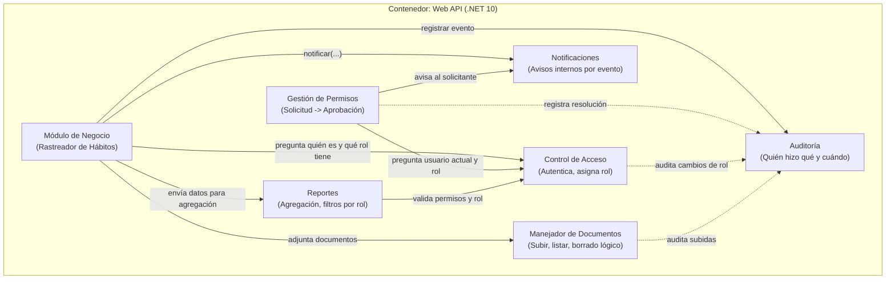

# 🎯 HabitTracker Nexus - Sistema Académico Distribuido

Plataforma de alta fidelidad para el registro de hábitos diarios, organización de metas y trazabilidad del progreso a lo largo del tiempo. Proyecto desarrollado en .NET 10 siguiendo estrictamente los principios de **Clean Architecture** y el patrón de **Monolito Modular**.

## 🏗️ Arquitectura de Componentes (C4 - Nivel 3)

El sistema opera bajo un único contenedor (Web API) dividido en 7 módulos completamente independientes. No existen bases de datos compartidas internamente ni dependencias cíclicas.

## 💻 Stack Tecnológico

**Framework Principal:** .NET 10 (Web API)

**Lenguaje:** C#

**Arquitectura:** Clean Architecture (Monolito Modular)

**ORM:** Entity Framework Core

**Seguridad:** JWT (JSON Web Tokens) & Hashing (Argon2/BCrypt)

**Testing:** xUnit / Moq

## 🤝 Guía de Colaboración (Workflow del Equipo)

Para garantizar el cumplimiento de los Requisitos de Diseño (RD) del contrato, todos los miembros del equipo deben adherirse a las siguientes directrices:

### 1. Flujo de Control de Versiones (Git Flow)

- Prohibido subir a main directamente. Todo desarrollo ocurre en la rama develop.
- Cada nueva pieza o característica se desarrolla en una rama aislada (ej. `feat/access-control` o `fix/user-login`).
- Los commits deben incluir el identificador del requisito funcional que resuelven (ej. `feat: hashear contraseña en registro [RF-CA-02]`).
- Toda rama debe ser integrada mediante un Pull Request (PR) y revisada por el otro miembro del equipo.

### 2. Reglas de Programación por Módulos

- **Cero código compartido genérico:** Está estrictamente prohibido crear carpetas como `Utils`, `Helpers` o `Common`. Cada módulo guarda lo suyo.
- **Separación de capas:** La lógica de negocio vive obligatoriamente en `Core.Application` o `Core.Domain`. Nunca en los controladores HTTP de la API (RD-02).
- **Fechas:** Todo registro de fecha en el sistema debe generarse utilizando `DateTime.UtcNow` (RD-11).

### 3. Comunicación entre Módulos

- **Prohibido cruzar fronteras de datos:** Un módulo NUNCA debe hacer un SELECT directo a las tablas de otro módulo.
- **Inyección de dependencias:** Si HabitTracker necesita saber quién está logueado, debe inyectar la interfaz expuesta por AccessControl y solicitar la información. La dependencia viaja en un solo sentido.

### 4. Estrategia de Pruebas (Testing)

- **Aislamiento (RD-12):** Cada pieza del Core debe poder probarse sin levantar la aplicación completa.
- Toda máquina de estados (Permisos y Metas) debe contar con pruebas unitarias en xUnit que validen transiciones permitidas y rechacen transiciones prohibidas antes de integrarse con la base de datos.
