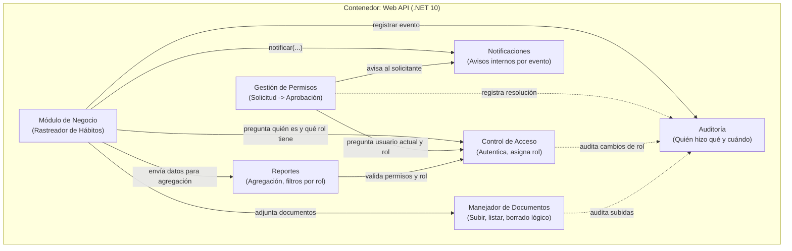

# 🎯 HabitTracker Nexus - Sistema de Gestión de Hábitos

Plataforma de alta fidelidad para el registro de hábitos diarios, organización de metas y trazabilidad del progreso a lo largo del tiempo. Proyecto desarrollado en .NET 10 siguiendo estrictamente los principios de **Clean Architecture** y el patrón de **Monolito Modular**.

## 🏗️ Arquitectura de Componentes (C4 - Nivel 3)

El sistema opera bajo un único contenedor (Web API) dividido en 7 módulos completamente independientes. No existen bases de datos compartidas internamente ni dependencias cíclicas.

> **Nota:** El módulo `DocManager` reflejado en el diagrama corresponde al directorio físico `Modules/DocumentManager`.


```mermaid
graph TD
    subgraph "Contenedor: Web API (.NET 10)"
        AccessControl["Control de Acceso\n(Autentica, asigna rol)"]
        Permissions["Gestión de Permisos\n(Solicitud -> Aprobación)"]
        DocManager["Manejador de Documentos\n(Subir, listar, borrado lógico)"]
        Notifications["Notificaciones\n(Avisos internos por evento)"]
        Reports["Reportes\n(Agregación, filtros por rol)"]
        Auditing["Auditoría\n(Quién hizo qué y cuándo)"]
        HabitTracker["Módulo de Negocio\n(Rastreador de Hábitos)"]
    end

    HabitTracker -->|"pregunta quién es y qué rol tiene"| AccessControl
    HabitTracker -->|"notificar(...)"| Notifications
    HabitTracker -->|"registrar evento"| Auditing
    HabitTracker -->|"adjunta documentos"| DocManager
    HabitTracker -->|"envía datos para agregación"| Reports
    
    Permissions -->|"pregunta usuario actual y rol"| AccessControl
    Permissions -->|"avisa al solicitante"| Notifications
    Permissions -.->|"registra resolución"| Auditing
    
    Reports -->|"valida permisos y rol"| AccessControl
    
    AccessControl -.->|"audita cambios de rol"| Auditing
    DocManager -.->|"audita subidas"| Auditing
```

## 🚀 Compilación y Ejecución

Para trabajar con este proyecto, asegúrate de tener instalado el SDK de .NET 10 o superior.

```bash
# Compilar la solución entera
dotnet build HabitTrackerSystem.slnx

# Ejecutar la Web API localmente
dotnet run --project Host/WebApi/WebApi.csproj

# Ejecutar toda la suite de pruebas unitarias
dotnet test
```

## 🗂️ Modelo de Datos del Negocio (Rastreador de Hábitos)

El módulo de negocio está estructurado sobre 6 entidades que modelan la trazabilidad completa de hábitos, metas y progreso del usuario.

| Entidad | Descripción | Relaciones |
|---|---|---|
| **`Categoria`** | Agrupa hábitos por tipo de actividad (ej. salud, productividad, finanzas). | Tiene muchas `Metas` asociadas. |
| **`Meta`** | Representa un objetivo a alcanzar con un título, estado y fecha límite. | Pertenece a una `Categoria`, contiene `Habitos` y `Recompensas`. |
| **`Habito`** | Define la acción diaria repetible con su nombre y frecuencia de ejecución. | Pertenece a una `Meta`, tiene `RegistrosDiarios` y `Etiquetas`. |
| **`RegistroDiario`** | Registro transaccional del avance del hábito en una fecha específica (completado o no). | Pertenece a un `Habito`. |
| **`Etiqueta`** | Etiqueta descriptiva y visual que clasifica hábitos por características (ej. urgente, preferido). | Asociada a muchos `Habitos`. |
| **`Recompensa`** | Sistema de puntos canjeables por el cumplimiento de metas, incentivando la constancia. | Pertenece a una `Meta`. |

**Flujo de relaciones:** `Categoria` → `Meta` → `Habito` → `RegistroDiario`, con `Etiqueta` y `Recompensa` como referencias transversales a `Habito` y `Meta` respectivamente.

## 💻 Stack Tecnológico

**Framework Principal:** .NET 10 (Web API)

**Lenguaje:** C#

**Arquitectura:** Clean Architecture (Monolito Modular)

**ORM:** Entity Framework Core

**Seguridad:** JWT (JSON Web Tokens) & Hashing (Argon2/BCrypt)

**Testing:** xUnit / Moq

## 🤝 Guía de Colaboración (Workflow del Equipo)

Para garantizar el cumplimiento de los Requisitos de Diseño (RD) del contrato, todos los miembros del equipo deben adherirse a las siguientes directrices:

### 1. Flujo de Control de Versiones (Git Flow)

- Prohibido subir a main directamente. Todo desarrollo ocurre en la rama develop.
- Cada nueva pieza o característica se desarrolla en una rama aislada (ej. `feat/access-control` o `fix/user-login`).
- Los commits deben incluir el identificador del requisito funcional que resuelven (ej. `feat: hashear contraseña en registro [RF-CA-02]`).
- Toda rama debe ser integrada mediante un Pull Request (PR) y revisada por el otro miembro del equipo.

### 2. Reglas de Programación por Módulos

- **Cero código compartido genérico:** Está estrictamente prohibido crear carpetas como `Utils`, `Helpers` o `Common`. Cada módulo guarda lo suyo.
- **Separación de capas:** La lógica de negocio vive obligatoriamente en `Core.Application` o `Core.Domain`. Nunca en los controladores HTTP de la API (RD-02).
- **Fechas:** Todo registro de fecha en el sistema debe generarse utilizando `DateTime.UtcNow` (RD-11).

### 3. Comunicación entre Módulos

- **Prohibido cruzar fronteras de datos:** Un módulo NUNCA debe hacer un SELECT directo a las tablas de otro módulo.
- **Inyección de dependencias:** Si HabitTracker necesita saber quién está logueado, debe inyectar la interfaz expuesta por AccessControl y solicitar la información. La dependencia viaja en un solo sentido.

### 4. Estrategia de Pruebas (Testing)

- **Aislamiento (RD-12):** Cada pieza del Core debe poder probarse sin levantar la aplicación completa.
- Toda máquina de estados (Permisos y Metas) debe contar con pruebas unitarias en xUnit que validen transiciones permitidas y rechacen transiciones prohibidas antes de integrarse con la base de datos.

## Evaluación de Práctica 1 (Control de Acceso y Hábitos)

### Requisitos Previos y Variables de Entorno
Para ejecutar este proyecto, necesitas configurar User Secrets o variables de entorno locales. **Nunca incluyas valores reales en el código fuente.**

*   `JwtSettings:Clave`: (String) Clave secreta larga para firmar los tokens JWT.
*   `JwtSettings:Issuer`: (String) Emisor del token (ej. `HabitTrackerApi`).
*   `JwtSettings:Audience`: (String) Audiencia del token (ej. `HabitTrackerUsers`).

### Instrucciones de Ejecución
1. Restaura las herramientas y paquetes: `dotnet restore`
2. Aplica las migraciones a tu base de datos local (SQL Server):
   `dotnet ef database update --project Infrastructure --startup-project WebApi`
3. Levanta la API:
   `dotnet run --project Host/WebApi`

### Guía de Pruebas (Criterios de Aceptación)
Sigue estas instrucciones desde Swagger o Postman para validar la rúbrica:

*   **Registro y rechazo controlado:** Usa `POST /api/auth/register` con una clave menor a 8 caracteres o sin números. Recibirás un error 400 controlado.
*   **Encolado de correos (Sin SMTP):** Si el servidor SMTP no está configurado o falla, el registro (201 Created) y la recuperación de clave terminan con éxito. Los correos quedan pendientes en la tabla/cola interna.
*   **Activación y un solo uso:** Tras registrarte, usa el token simulado en `POST /api/auth/activate`. Si lo envías dos veces, la segunda vez será rechazado.
*   **Seguridad de enumeración (Recuperación):** Llama a `POST /api/auth/recuperar-password` con un correo falso y luego con el verdadero. El sistema devolverá un `200 OK` idéntico y en el mismo tiempo.
*   **Bloqueo de fuerza bruta (15 min):** Llama a `POST /api/auth/login` con clave incorrecta 5 veces seguidas. Al 6to intento, recibirás un error de bloqueo temporal.
*   **Invalidación de sesión (Logout / Cambio de Rol/Clave):** Inicia sesión, guarda el JWT. Llama a `POST /api/auth/logout`. Vuelve a intentar usar el JWT en `GET /api/auth/me`; recibirás un `401 Unauthorized`.
*   **Protección por Roles:** Como usuario Estándar, intenta invocar `GET /api/admin/usuarios` (construyendo la petición manualmente si es necesario). El sistema devolverá `403 Forbidden`.
*   **Desactivación y Autodesactivación:** Como Administrador, intenta desactivarte a ti mismo en `PATCH /api/admin/usuarios/{tu_id}/estado`. El sistema lo rechazará. Desactiva a otro usuario y sus sesiones abiertas morirán instantáneamente.

---
*Documentación de la Máquina de Estados disponible en `docs/maquina-de-estados.md`.*
